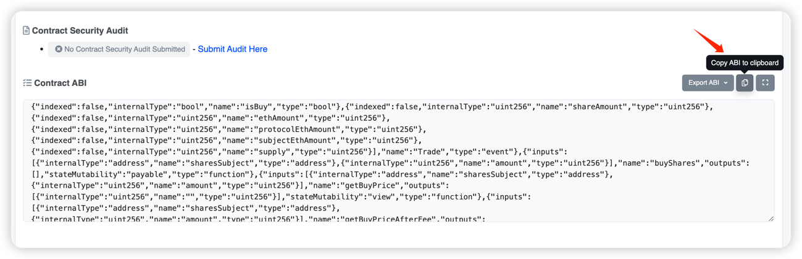
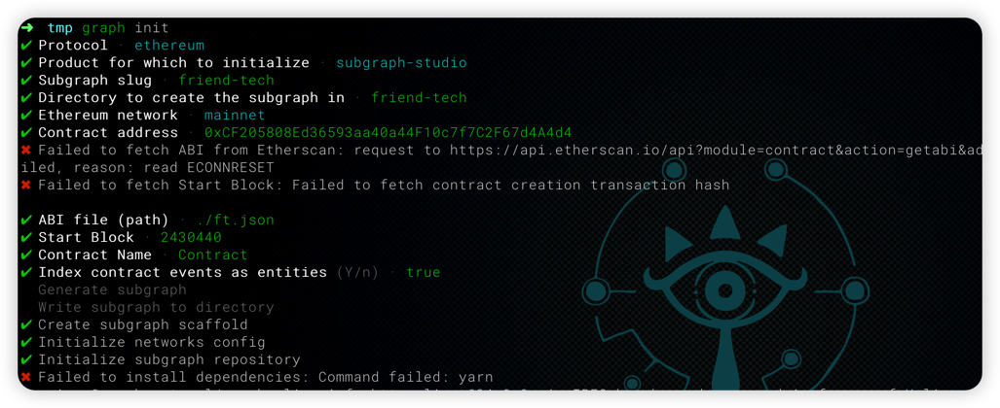
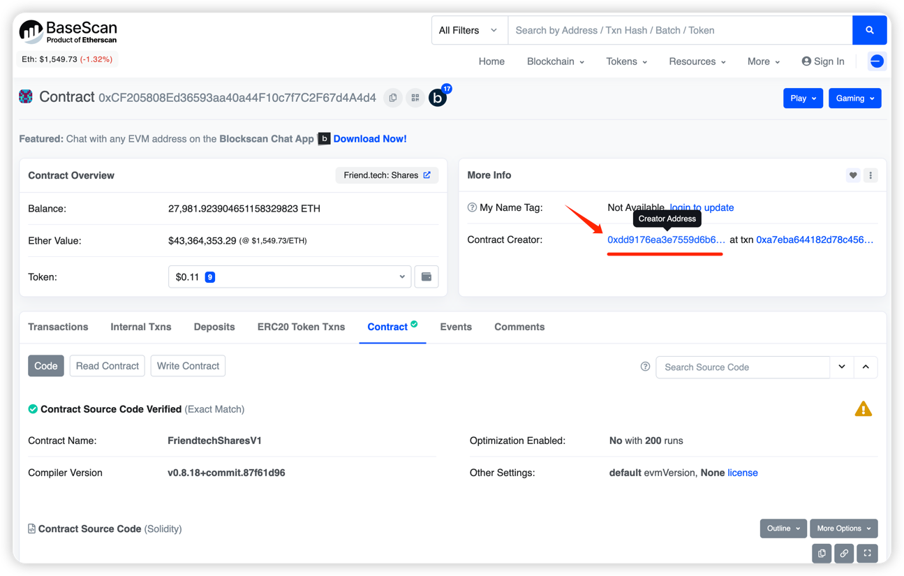
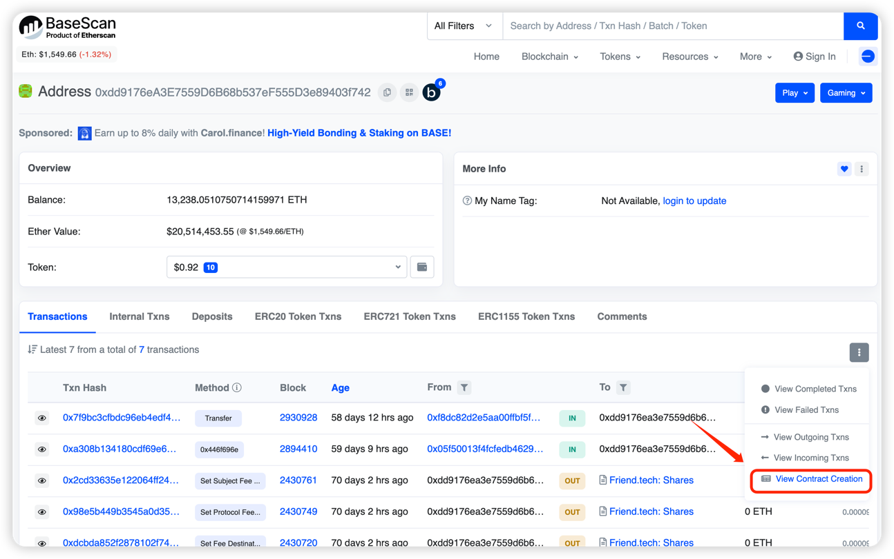
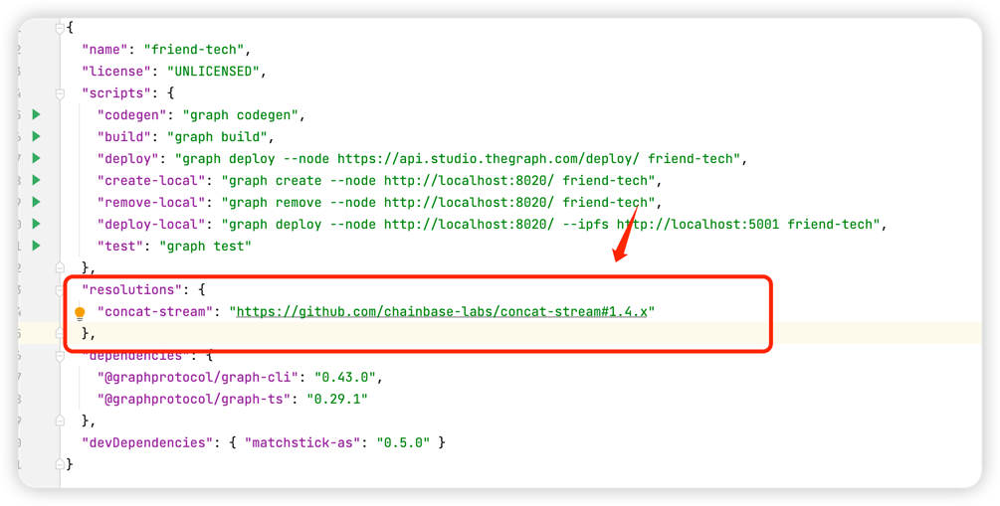
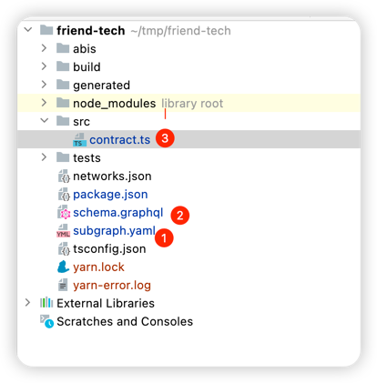
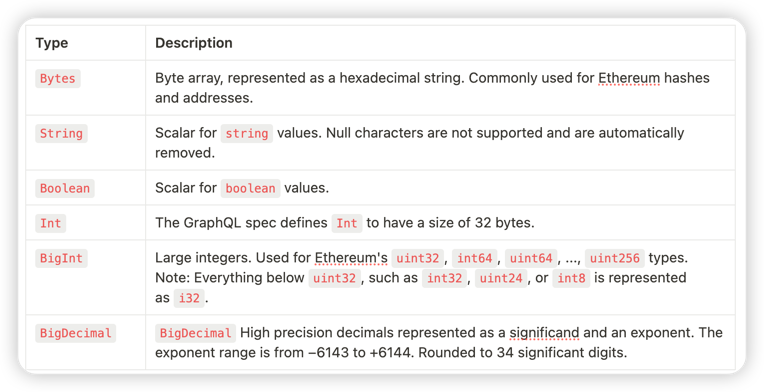
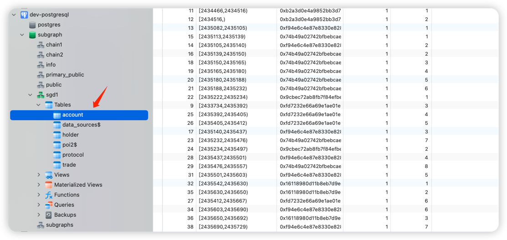
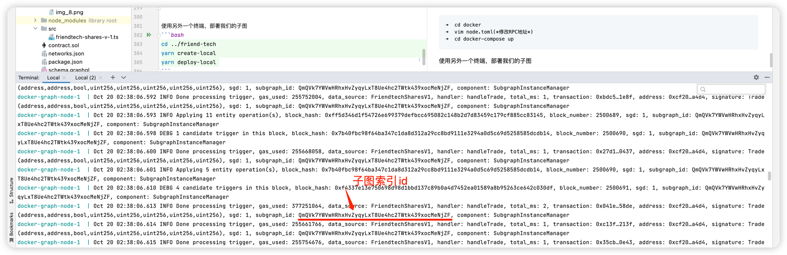
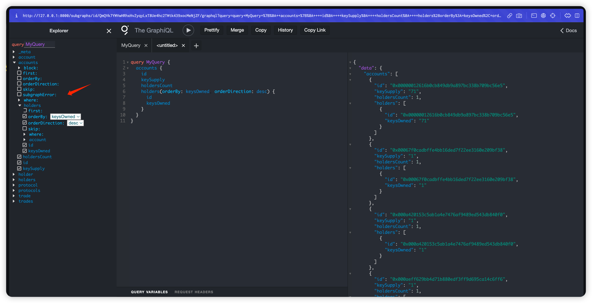

# Friend Tech subgraph 开发

---
Friend Tech 项目信息
- 项目名称：Friend Tech
- 项目描述：Friend Tech 是一个去中心化社交平台，允许用户将自己代币化。
- 公链：Base
- 合约地址： 0xCF205808Ed36593aa40a44F10c7f7C2F67d4A4d4
- 网址：https://www.friend.tech

### 一、 安装依赖

```bash
yarn add @graphprotocol/graph-cli
yarn add @graphprotocol/graph-ts
```

### 二、 subgraph创建
### 2.1 下载合约abi文件
首先我们可以手动下载合约的abi文件到本地，加速创建过程，合约abi地址：https://basescan.org/address/0xCF205808Ed36593aa40a44F10c7f7C2F67d4A4d4#code
将abi文件内容写入到ft.json文件中


```bash
➜ cd tmp
➜ vim ft.json
➜ cat ft.json
[{"anonymous":false,"inputs":[{"indexed":true,"internalType":"address","name":"previousOwner","type":"address"},{"indexed":true,"internalType":"address","name":"newOwner","type":"address"}],
...
```

### 2.2 初始化subgraph项目
首先安装完 graph-cli 工具后，我们在本地创建一个新的目录，然后在终端使用命令graph init初始化一个新的subgraph项目

graph cli 客户端会引导你一步步创建，需要自定义的参数会按照不同的客户端版本有所不同，但是大致如下:
```bash
➜  tmp graph init
✔ Protocol · ethereum
✔ Product for which to initialize · subgraph-studio
✔ Subgraph slug · friend-tech
✔ Directory to create the subgraph in · friend-tech
✔ Ethereum network · mainnet # evm兼容的公链都可以选mainnet
✔ Contract address · 0xCF205808Ed36593aa40a44F10c7f7C2F67d4A4d4 # 合约地址
✖ Failed to fetch ABI from Etherscan: request to https://api.etherscan.io/api?module=contract&action=getabi&address=0xCF205808Ed36593aa40a44F10c7f7C2F67d4A4d4 failed, reason: read ECONNRESET
✖ Failed to fetch Start Block: Failed to fetch contract creation transaction hash

✔ ABI file (path) · ./ft.json  # 这里填我们手动下载的abi文件
✔ Start Block · 2430440 # 合约创建的区块高度
✔ Contract Name · Contract
✔ Index contract events as entities (Y/n) · true
  Generate subgraph
  Write subgraph to directory
✔ Create subgraph scaffold
✔ Initialize networks config
✔ Initialize subgraph repository
✖ Failed to install dependencies: Command failed: yarn # 有报错不要仅 下面教大家如何解决
```
获取合约部署区块高度


最后 yarn 或者 npm 会根据初始化流程安装一些具体项目依赖，其中可能会有一个 concat-stream github 仓库版本不存在特定分支feat/smaller的报错，我们可以使用package.json 里面的resolutions 将有问题的分支重定向到我们chainbase的分支：
```json
  "resolutions": {
    "concat-stream": "https://github.com/chainbase-labs/concat-stream#1.4.x"
  },
```


最后重新执行一次 yarn 安装确认项目初始化依赖是否正常
```bash
yarn && yarn install
```

### 2.3 编写subgraph schema

graph init 完成后默认就会为我们自动生成上面的框架代码，只需要修改几个文件就可以达到我们想索引 bayc 合约的目地。接下来让我们一步步了解各个文件的作用，并尝试编写出能索引合约数据的subgraph
1. subgraph.yaml
   第一步是需要定义我们的数据源，也就是告诉 subgraph 具体索引什么智能合约，合约地址、网络、abi和索引触发的一些处理器等
```bash
specVersion: 0.0.5
schema:
  file: ./schema.graphql
dataSources:
  - kind: ethereum
    name: Contract
    network: mainnet
    source:
      address: "0xCF205808Ed36593aa40a44F10c7f7C2F67d4A4d4"
      abi: Contract
      startBlock: 2430440
    mapping:
      kind: ethereum/events
      apiVersion: 0.0.7
      language: wasm/assemblyscript
      entities:
        - OwnershipTransferred
        - Trade
      abis:
        - name: Contract
          file: ./abis/Contract.json
      eventHandlers:
        - event: Trade(address,address,bool,uint256,uint256,uint256,uint256,uint256)
          handler: handleTrade
      file: ./src/contract.ts
```
The Graph 允许我们在EVM 链上定义三种处理函数：事件处理函数、调用处理函数和块处理函数。详细可以参考：**[Subgraph Manifest](https://github.com/graphprotocol/graph-node/blob/master/docs/subgraph-manifest.md)**

这里核心的处理函数就是eventHandlers，它定义了我们从区块链事件中怎么索引数据。拿Transfer事件举例：

- 每当一个 NFT 从一个地址转移到另外一个地址时，就会触发此事件。它会记录NFT 的前所有者、新所有者和具体的 NFT TOKEN ID
- 我们希望能从初始区块开始记录transfer，这样我们就能记录完整的BAYC NFT完整的所有权历史
- 此外，在后面定义Transfer ID 实体时如果将其标记为不可变，那么查询速度会更快

2. schema.garphql
   schema定义了我们需要存储的数据类型，也就是最终存储到 postgresql 的字段，后续也可以通过这些字段来自定义查询语句
```bash
type Protocol @entity {
  id: ID!
  userCount: Int!
  protocolRevenue: BigDecimal!
  accountRevenue: BigDecimal!
  tradeVolume: BigDecimal!
  totalTrades: Int!
}

type Account @entity {
  id: ID!
  holdersCount: Int!
  keySupply: BigDecimal!
  holders: [Holder!]! @derivedFrom(field: "account")
}

type Holder @entity {
  id: ID!
  account: Account!
  keysOwned: BigDecimal!
}

type Trade @entity {
  id: ID!
  trader: Bytes!
  subject: Bytes!
  isBuy: Boolean!
  shareAmount: BigDecimal!
  ethAmount: BigDecimal!
  protocolEthAmount: BigDecimal!
  subjectEthAmount: BigDecimal!
  supply: BigDecimal!
}
```
这里有几点需要注意，每个实体需要有 @entity 指令。还需要有一个 ID字段，该字段的唯一值必须适用于所有相同类型的实体。下面是一些常见的数据类型，详细可以参考：类型


3. contract.ts(friendtech-shares-v-1.ts)
   这个文件是我们的处理器，也就是我们从区块链事件中索引数据的具体逻辑，这里我们只需要关注 handleTrade 函数，它会在每次 Transfer 事件触发时被调用，我们可以在这里定义我们需要索引的数据
```bash
import { BigDecimal, crypto, BigInt, Bytes } from '@graphprotocol/graph-ts'
import {
    Trade as TradeEvent,
} from '../../../friend-tech/generated/FriendtechSharesV1/FriendtechSharesV1'
import { Trade, Protocol, Account, Holder } from '../../../friend-tech/generated/schema'

function getOrCreateAccount(accountId: string): Account {
    let account = Account.load(accountId)
    if (account == null) {
        account = new Account(accountId)
        account.holdersCount = 0
        account.keySupply = BigDecimal.fromString('0')
        account.save()
    }
    return account as Account
}

function getOrCreateHolder(holderId: string, account: Account): Holder {
    let holder = Holder.load(holderId)
    if (holder == null) {
        holder = new Holder(holderId)
        holder.keysOwned = BigDecimal.fromString('0')
        holder.account = account.id
        holder.save()

        // Update account's holders count
        account.holdersCount = account.holdersCount + 1
        account.save()
    }
    return holder as Holder
}

function getOrCreateProtocol(protocolId: string): Protocol {
    let protocol = Protocol.load(protocolId)
    if (protocol == null) {
        protocol = new Protocol(protocolId)
        protocol.userCount = 0
        protocol.protocolRevenue = BigDecimal.fromString('0')
        protocol.accountRevenue = BigDecimal.fromString('0')
        protocol.tradeVolume = BigDecimal.fromString('0')
        protocol.totalTrades = 0
        protocol.save()
    }
    return protocol as Protocol
}

export function handleTrade(event: TradeEvent): void {
    let trade = new Trade(event.transaction.hash.toHex() + "-" + event.logIndex.toString())
    trade.trader = event.params.trader
    trade.subject = event.params.subject
    trade.isBuy = event.params.isBuy
    trade.shareAmount = event.params.shareAmount.toBigDecimal()
    trade.ethAmount = event.params.ethAmount.toBigDecimal()
    trade.protocolEthAmount = event.params.protocolEthAmount.toBigDecimal()
    trade.subjectEthAmount = event.params.subjectEthAmount.toBigDecimal()
    trade.supply = event.params.supply.toBigDecimal()
    trade.save()

    let protocol = getOrCreateProtocol('1') // Assuming there is only one protocol
    protocol.tradeVolume = protocol.tradeVolume.plus(trade.ethAmount)
    protocol.totalTrades = protocol.totalTrades + 1
    protocol.protocolRevenue = protocol.protocolRevenue.plus(trade.protocolEthAmount)
    protocol.accountRevenue = protocol.accountRevenue.plus(trade.subjectEthAmount)
    protocol.userCount = protocol.userCount + 1 // This logic may need adjustment based on your specific definition of a user
    protocol.save()

    let accountId = event.params.trader.toHex()
    let account = getOrCreateAccount(accountId)

    account.keySupply = account.keySupply.plus(trade.shareAmount) // Assuming shareAmount corresponds to keys
    account.save()

    let holderId = event.transaction.from.toHex()
    let holder = getOrCreateHolder(holderId, account)

    holder.keysOwned = holder.keysOwned.plus(trade.shareAmount) // Update the keys owned by this holder
    holder.save()
}
```

### 2.3 编译和构建
到这里，我们已经完整开发完成了一个简单的subgraph，接下来就可以编译我们的代码并且部署 subgraph 。

1. graph codegen

每次修改完subgraph.yaml 和scheme.graphql文件后都要执行 codegen，用来生成generated目录中对应的AssemblyScript文件：
```bash
➜  friend-tech git:(main) ✗ graph codegen               
  Skip migration: Bump mapping apiVersion from 0.0.1 to 0.0.2
  Skip migration: Bump mapping apiVersion from 0.0.2 to 0.0.3
  Skip migration: Bump mapping apiVersion from 0.0.3 to 0.0.4
  Skip migration: Bump mapping apiVersion from 0.0.4 to 0.0.5
  Skip migration: Bump mapping apiVersion from 0.0.5 to 0.0.6
  Skip migration: Bump manifest specVersion from 0.0.1 to 0.0.2
  Skip migration: Bump manifest specVersion from 0.0.2 to 0.0.4
✔ Apply migrations
✔ Load subgraph from subgraph.yaml
  Load contract ABI from abis/Contract.json
✔ Load contract ABIs
  Generate types for contract ABI: Contract (abis/Contract.json)
  Write types to generated/Contract/Contract.ts
✔ Generate types for contract ABIs
✔ Generate types for data source templates
✔ Load data source template ABIs
✔ Generate types for data source template ABIs
✔ Load GraphQL schema from schema.graphql
  Write types to generated/schema.ts
✔ Generate types for GraphQL schema

Types generated successfully
```

2. graph build
将subgraph变成成WebAssembly，等待部署
```bash
➜  friend-tech git:(main) ✗ graph build  
  Skip migration: Bump mapping apiVersion from 0.0.1 to 0.0.2
  Skip migration: Bump mapping apiVersion from 0.0.2 to 0.0.3
  Skip migration: Bump mapping apiVersion from 0.0.3 to 0.0.4
  Skip migration: Bump mapping apiVersion from 0.0.4 to 0.0.5
  Skip migration: Bump mapping apiVersion from 0.0.5 to 0.0.6
  Skip migration: Bump manifest specVersion from 0.0.1 to 0.0.2
  Skip migration: Bump manifest specVersion from 0.0.2 to 0.0.4
✔ Apply migrations
✔ Load subgraph from subgraph.yaml
  Compile data source: Contract => build/Contract/Contract.wasm
✔ Compile subgraph
  Copy schema file build/schema.graphql
  Write subgraph file build/Contract/abis/Contract.json
  Write subgraph manifest build/subgraph.yaml
✔ Write compiled subgraph to build/

Build completed: build/subgraph.yaml
```

3. 部署我们的子图
   启动我们的本地docker实例（注意修改node.toml中的rpc地址，需要api key，如果没有可以到chainbase后台创建）

```bash
➜  cd docker
➜  vim node.toml(*修改RPC地址*)
➜  cd docker-compose up
```
部署成功后，我们稍等几分钟，本都数据库中应该就有我们的索引数据了


使用另外一个终端，部署我们的子图
```bash
cd ../friend-tech 
yarn create-local
yarn deploy-local 
```

部署成功后，可以在docker运行日志里面看到我们新部署的子图deployment_id

本地打开graphql查询窗口
http://127.0.0.1:8000/subgraphs/id/QmQVk7YWVwHRhxHvZyqyLxT8Ue4hc2TWtk439xocMeNjZF
